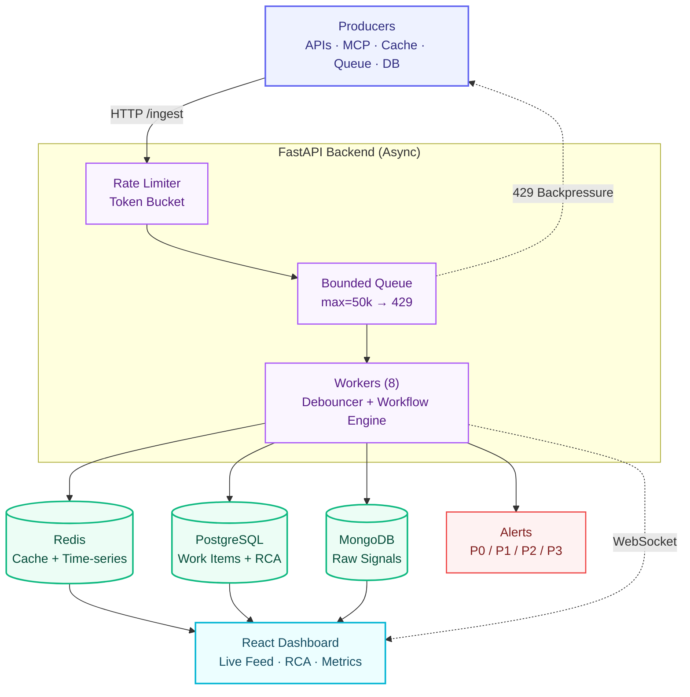
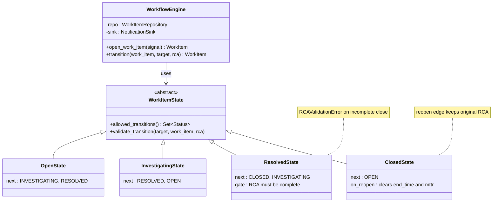
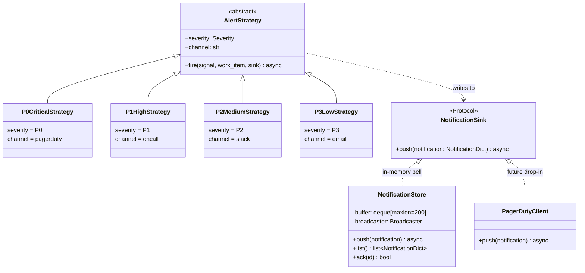

# Architecture

## 1. The diagram

---

## 2. Layer-by-layer breakdown

### Layer 1 — Producers
- Any HTTP-speaking client: monitoring agents, Lambdas, shell scripts, the
  in-app load generator.
- No coupling to any specific protocol or library.
- Two endpoints: `POST /ingest` (single signal) and `POST /ingest/batch`
  (up to thousands per HTTP RTT).

### Layer 2 — FastAPI backend (async)
Three responsibilities, each pure-in-memory and synchronous to the producer:

- **Rate Limiter** — per-IP token bucket, refills at 12 k req/s, capacity
  20 k. Cost = `len(batch)`, so batching cannot bypass.
- **Bounded Queue** — `asyncio.Queue(maxsize=50_000)`. Non-blocking
  `put_nowait`. If full, raises `QueueFull` → producer gets HTTP 429 +
  `Retry-After: 1`. The process never OOMs because memory is capped.
- **Workers (8)** — `asyncio.create_task` consumers awaiting `queue.get()`.
  Each worker runs the **Debouncer** and then the **WorkflowEngine**.

### Layer 3 — Storage (right tool per purpose)
| Store | Role | Why |
|---|---|---|
| **MongoDB** | Raw signals · audit log | Schemaless, append-heavy. Indexed on `(component_id, received_at)`, `work_item_id`, `received_at`. Queryable via `GET /signals/search`. |
| **PostgreSQL** | Work Items + RCA | ACID transactions; FK from `rcas.work_item_id → work_items` enforces the RCA-before-CLOSE invariant at the DB level. |
| **Redis** | Cache + Time-series | One container, two roles. Dashboard hot-path via HASH (HVALS sub-ms); per-minute TS via HINCRBY (atomic, lock-free). |

### Layer 4 — Alerts (Strategy Pattern dispatch)
| Component type | Severity → Strategy → Channel |
|---|---|
| RDBMS · MCP_HOST | P0 · `P0CriticalStrategy` · PagerDuty (on-call) |
| API · QUEUE | P1 · `P1HighStrategy` · On-call notification |
| CACHE · NOSQL | P2 · `P2MediumStrategy` · Slack #ops |
| OTHER (default) | P3 · `P3LowStrategy` · Email digest |

Each `AlertStrategy` writes to a `NotificationSink` Protocol — currently an
in-process ring buffer that powers the dashboard's bell icon. Swapping in
real PagerDuty / Slack clients is one new class.

### Layer 5 — React dashboard
- **Live Feed** sorted by severity, with a search bar.
- **Incident Detail** with raw signals fetched from Mongo.
- **RCA Form** — datetime pickers, dropdown, text areas with live char-count.
- **Metrics tiles** — status counters, Avg MTTR, queue depth, "Signals (1h)"
  sparkline reading from Redis.
- **Notification bell** — unread badge updated live via WebSocket.
- **Reopen-after-close** + mobile responsive layout.

---

## 3. Request flow — one signal end-to-end

The producer sees one of two outcomes: **HTTP 202** (accepted) or **HTTP 429**
(back off and retry). Everything after `202` happens asynchronously.

1. Producer → `POST /ingest`. Middleware runs API-key check, body-size cap
   (HTTP 413 if > 1 MiB), GZip, and X-Request-ID assignment.
2. Token-bucket rate limiter and bounded queue admit the signal — either
   succeeds (`202`) or returns `429 + Retry-After: 1`.
3. A worker dequeues, takes the per-component `asyncio.Lock`, and asks the
   `Debouncer` to either open a new Work Item (leader) or link to the open
   one (follower).
4. `WorkflowEngine` inserts to Postgres, fires the matching `AlertStrategy`,
   pushes a `NotificationDict` to the sink, writes to Mongo + Redis.
5. WebSocket fans the event out — every connected dashboard updates the live
   feed, sparkline, and bell badge instantly.

Full step-by-step in [§7.4 sequence diagram](#74-sequence--one-signal-end-to-end).

---

## 4. Edge handling — admission control & defence in depth

| Concern | Mechanism | Default | Configurable via |
|---|---|---|---|
| Bursts over 50 k pending signals | Bounded `asyncio.Queue` → HTTP 429 + `Retry-After: 1` | maxsize = 50,000 | `QUEUE_MAX_SIZE` |
| Single client floods the API | Per-IP token bucket, cost = `len(batch)` | 12 k req/s, 20 k burst | `RATE_LIMIT_PER_SECOND`, `RATE_LIMIT_BURST` |
| Memory abuse via huge requests | `Content-Length` middleware → HTTP 413 | 1 MiB | `MAX_REQUEST_BODY_BYTES` |
| Unauthorised ingest | Optional `X-API-Key` header (constant-time compare) | disabled in dev | `INGEST_API_KEY` |
| Cross-origin browser requests | CORS allow-list | `*` for dev | `CORS_ALLOW_ORIGINS` |
| Bandwidth on JSON payloads | GZip middleware on responses ≥ 1 KiB | always on | — |
| Request tracing | X-Request-ID middleware (echoed in response + access log) | always on | — |

**Both forms of overload return the same HTTP code (429)** so producers have
one rule to follow: `if 429: backoff(retry_after)`. This single contract is
the system's most important resilience property.

---

## 5. Backpressure — five layers

| # | Layer | What it does |
|---|---|---|
| 1 | Bounded queue | `put_nowait` on `asyncio.Queue(maxsize=50_000)`; full → HTTP 429. Memory capped → no OOM. |
| 2 | Rate limiter | Per-IP token bucket; one noisy client cannot starve others. |
| 3 | Async workers | No thread pinning; throughput bounded by storage latency, not thread-pool size. |
| 4 | Tenacity retry | 3 attempts, exp-backoff 100 ms → 2 s on every DB write. |
| 5 | Failure isolation | Single-store outage logs + drops; pipeline keeps going. |

**Verified live** (10,000 sig/s × 5 s): 46,305 accepted, queue 39,966 / 50,000,
**0 dropped**, container `(healthy)`. Deep dive — including code, memory math,
and operator-visible signals.

---

## 6. Why this architecture is the right fit

| Decision | Why this is best for the brief |
|---|---|
| **Bounded `asyncio.Queue`** between edge and workers | Decouples ingest latency from storage latency. Most "10K sig/s" implementations crash under burst because they don't decouple. |
| **Per-component `asyncio.Lock` in the Debouncer** | Race-free leader election under 8 concurrent workers. Different components still parallelise — the lock is fine-grained, not global. |
| **Three storage tiers (Mongo + Postgres + Redis)** | Each store does only what it's best at. Trying to make any one of them do all three would lose key properties (FK enforcement, schemaless flexibility, sub-ms latency). |
| **State Pattern for the lifecycle** | RCA gate lives inside `ResolvedState.validate_transition()`. Adding a new code path that closes a Work Item cannot bypass the check. |
| **Strategy + Sink Protocol for alerts** | The alert channel is dispatched by `component_type` at runtime. Swapping in a real PagerDuty client is one new class with a single `push()` method. |
| **Repository Pattern over storage** | Business logic depends on the abstraction, not the driver. Swap MongoDB for DynamoDB or InfluxDB for Timescale by replacing one class. |
| **HTTP+JSON over gRPC** | Universal producer support; `/ingest/batch` gives ~95 % of gRPC's throughput at zero codegen cost. |
| **Docker Compose over Kubernetes** | One file vs. ~20 manifests. Same images run identically on either; K8s is the natural production migration. |

---

## 7. Low-Level Design (LLD)

Two diagrams cover the design: the **State Pattern** for the incident
lifecycle and the **Strategy + Sink Protocol** for alert routing.

### 7.1 State Pattern — incident lifecycle

**Invariant** — every code path that closes a Work Item routes through
`ResolvedState.validate_transition()`. The RCA gate cannot be bypassed.

### 7.2 Strategy + Sink Protocol — alert routing

**Selection** — `select_strategy(component_type)` returns the right strategy at
runtime: `RDBMS / MCP_HOST → P0`, `API / QUEUE → P1`, `CACHE / NOSQL → P2`,
default → P3. Adding a new severity is one new class plus one map entry.

---

## 8. Resilience features

- **Bounded queue + 429** — never OOM under burst load.
- **Tenacity retry** (3 attempts, exp. backoff) on every DB write.
- **Per-storage failure isolation** — partial outages don't kill ingestion.
- **Rate limiter** — token bucket per client IP at the edge.
- **Health probe** — `/health` reports each downstream dependency separately.
- **Graceful shutdown** — workers drain the queue before exit (SIGTERM-aware).
- **WebSocket auto-reconnect** — dashboard recovers from backend restarts in
  ≤ 2 s, with a 5 s polling fallback that catches dropped frames.
- **Reopen-after-close** — incidents that regress can be revived; MTTR
  recomputes against the original `start_time`.
- **FK-enforced invariant** — `rcas.work_item_id REFERENCES work_items` so
  the database itself rejects an RCA without a parent Work Item.

---

## 9. Observability

| Signal | Where | Format |
|---|---|---|
| Throughput log every 5 s | `docker compose logs backend` | `[throughput] ingest=4861/s process=1787/s queue=15363 …` |
| Per-request structured access log | backend stdout | `req=<uuid> METHOD path -> code in Xms` |
| Per-dependency health | `GET /health` | JSON (curl) or styled HTML (browser) |
| Counters + gauges | `GET /metrics` | Prometheus exposition (or HTML) |
| Correlation tracing | `X-Request-ID` header | auto-generated or propagated; echoed everywhere |

