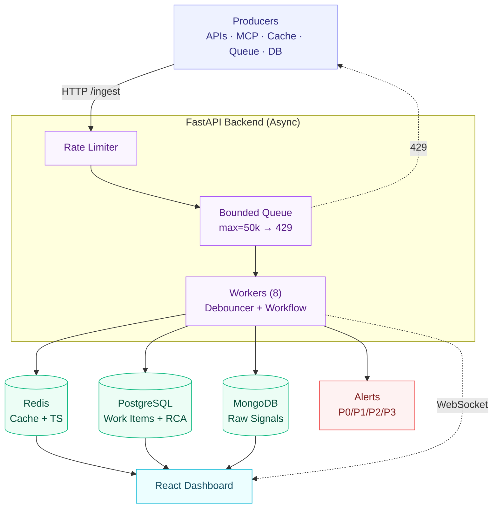

# Incident Management System (IMS)

## Overview

A resilient, mission-critical IMS that ingests up to **10,000 signals/sec**
from a distributed stack (APIs, MCP Hosts, Caches, Queues, RDBMS, NoSQL),
debounces same-component bursts into single Work Items, persists structured
incidents with a **mandatory Root Cause Analysis** before close, and exposes
a workflow-driven dashboard with a live notification bell.

---

## Setup — Docker Compose

```bash
git clone https://github.com/deveshruttala/zeotap-sre-assignment.git
cd zeotap-sre-assignment
docker compose up --build
```

Five containers come up healthy in ~15 s. Then open:

| URL | What |
|---|---|
| <http://localhost:5173> | Incident Dashboard |
| <http://localhost:8000/docs> | OpenAPI / Swagger explorer |
| <http://localhost:8000/health> | Health probe (HTML in browser, JSON via curl) |
| <http://localhost:8000/metrics> | Prometheus metrics |

To stop everything and wipe data:

```bash
docker compose down -v
```

---

## Architecture

<div align="center" >



*Full layer-by-layer breakdown in [`ARCHITECTURE.md`](./ARCHITECTURE.md)*

</div>

---


## Backpressure — surviving 10K signals/sec

Five layers, one producer contract: **see HTTP 429 → back off.**

- **Bounded queue** — `asyncio.Queue(maxsize=50,000)`; full → `429 + Retry-After`. Memory capped, no OOM.
- **Per-IP rate limiter** — token bucket (12 k/s, 20 k burst); cost = `len(batch)`.
- **8 async workers** — no thread pinning; throughput bounded by storage latency.
- **Tenacity retry** on every storage write (3× exp backoff, 100 ms → 2 s).
- **Per-storage isolation** — Redis down ≠ ingest down.

**Verified:** 10 k sig/s × 5 s = 46,305 accepted · queue 39,966 / 50,000 · **0 dropped** · `(healthy)`. Full deep-dive in the [submission docx](./Devesh%20Ruttala%20-%20Infrastructure-SRE%20Intern%20Assignment.docx).

---

## Sample data

```bash
python backend/scripts/simulate_failure.py http://localhost:8000
```

Reproduces an RDBMS → API → MCP → Cache → Queue cascade: 305 signals → exactly **6 work items** (perfect debounce). Or click **Simulate signal storm** in the dashboard header.


## Documentation

| File | What's in it |
|---|---|
| [`Devesh Ruttala - Infrastructure-SRE Intern Assignment.docx`](./Devesh%20Ruttala%20-%20Infrastructure-SRE%20Intern%20Assignment.docx) | The submission write-up — technical + non-technical abstract, full backpressure deep dive |
| [`ARCHITECTURE.md`](./ARCHITECTURE.md) | Architecture details — layer breakdown, request flow, LLD class layout, testing strategy |
| [`PROMPTS.md`](./PROMPTS.md) | Design notes and prompts used while building |

---
